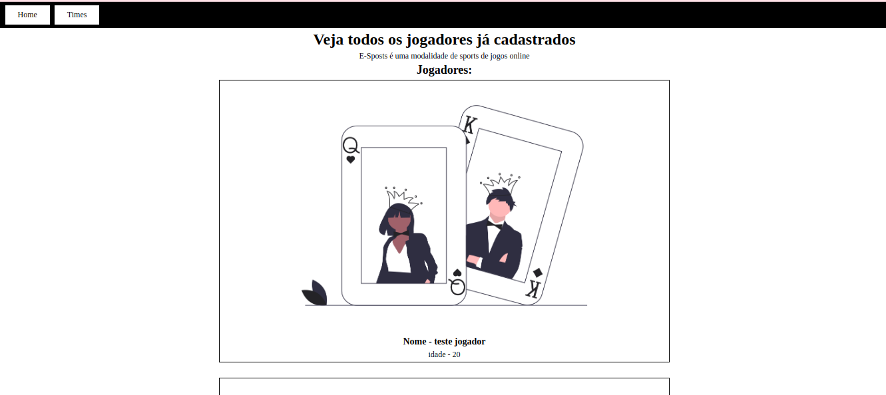
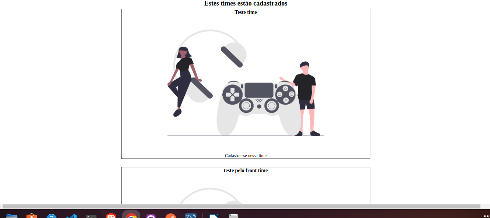
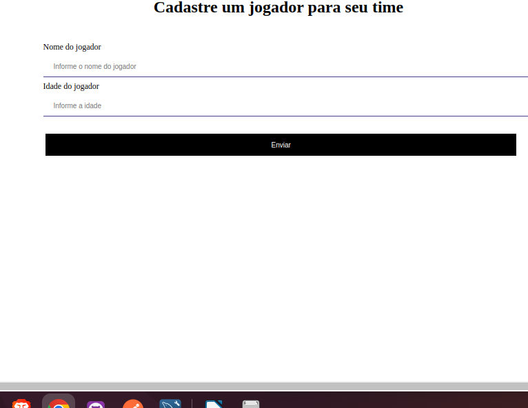

## para clonar o projeto basta usar o git clone (com o link do projeto)+ npm i para instalar as dependencias

## backend - nodejs
### nodemon, express, cors

## banco de dados - postgre
### docker(imagem do postgre), prisma(comunicação)
### comandos docker - docker compose up -d
## frontend - react

### react-router, react-icons, axios

 

 

